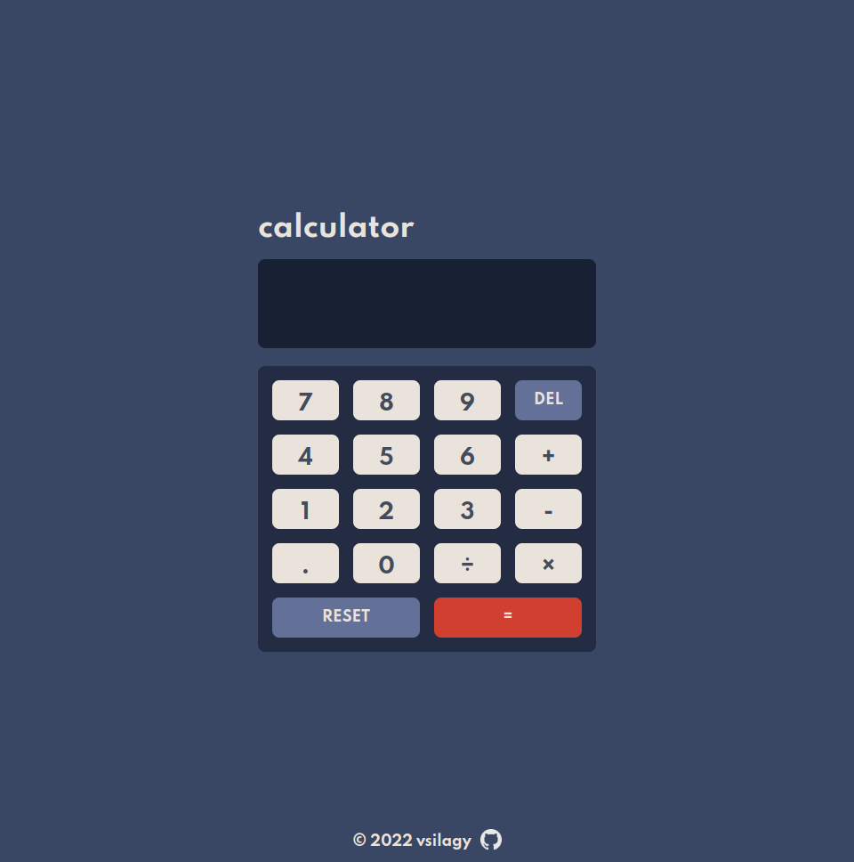

# Calculator

A simple calculator that performs basic arithmetics

[Live Preview](https://vsilagy.github.io/calculator)

## Built with:

- HTML
- CSS
- JavaScript

### **The Odin Project**: [Calculator](https://www.theodinproject.com/paths/foundations/courses/foundations/lessons/calculator)

#### Objectives:

- Build a calculator using JavaScript with add , subtract, multiple and divide
- For the UI I used [Frontend Mentor](https://www.frontendmentor.io/challenges/calculator-app-9lteq5N29)
- Used this video to for inspiration [Web Dev Simplified](https://www.youtube.com/watch?v=j59qQ7YWLxw)
- updated the style to be mobile responsive
